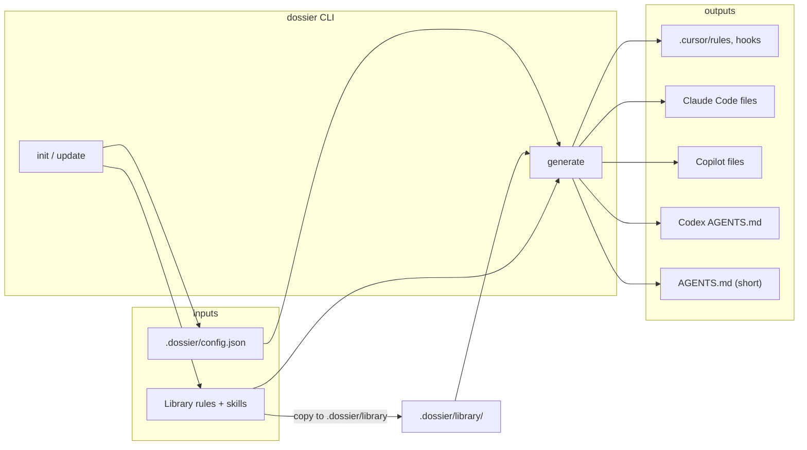

# Architecture

This page describes how `dossier` is structured on disk and how data flows from config to each coding agent.

## High-level flow

- **`init`** writes `config.json` and copies the **bundled** `library/` from the installed package into **`.dossier/library/`**.
- **`update`** refreshes only `.dossier/library/` from the package; it does not rewrite config.
- **`generate`** reads config, chooses a **library root** (see below), merges rules from the manifest with your language/framework selections, and writes agent-specific artifacts. Root **`AGENTS.md`** is a short summary for Cursor, Claude, and Copilot targets, and a Codex-oriented document (bundled rules inlined) for the `codex` target. The last `generate` invocation for a given repo wins if you mix targets.

## Directory layout

| Path | Role |
| --- | --- |
| `.dossier/config.json` | Source of truth: languages, frameworks per directory, global and scoped `customRules`, `hooks`, enabled agents, `supportDocs` |
| `.dossier/library/` | Synced copy of bundled rules (`library/rules/…`), skills (`library/skills/…`), and `manifest.json` — updated by `init` and `update` |
| `AGENTS.md` | Regenerated on every `generate`: short summary for Cursor / Claude / Copilot targets, or full bundled rules + config context for the `codex` target |

Agent-specific outputs (under the repo root):

- **Cursor** — `.cursor/rules/*.mdc` (library rules plus merged custom rules); optional `.cursor/hooks.json` when `hooks` are defined in config.
- **Claude Code** — `.claude/skills/<skill-id>/SKILL.md` for bundled and custom skills; hook definitions merged into `.claude/settings.json` under a `hooks` object.
- **GitHub Copilot** — `.github/copilot-instructions.md` (global rules and custom text); directory-scoped custom rules as `.github/instructions/dossier-dir-*.md` with `applyTo` front matter.
- **OpenAI Codex** — Root `AGENTS.md` with library rules and dossier context; `.agents/skills/*/SKILL.md` for bundled and custom skills; merged `.codex/hooks.json` when hooks target Codex; subdirectory `AGENTS.md` when a non-root `directories` entry has `customRules`.

## Library resolution

When generating, the library root is:

1. **`.dossier/library/`** if it contains `manifest.json` (normal after `init` or `update`).
2. Otherwise the **bundled** `library/` next to the installed package `dist/` (fallback for edge cases).

The manifest lists **entries** (rule and skill ids) with **tags** (`languages`, `frameworks`). For each entry in `config.directories`, `dossier` resolves which **rules** apply to that directory’s `lang` and `frameworks` and collects the union of rule ids. **Skills** are resolved the same way for agents that support them (e.g. Claude Code).

## Rules vs skills

- **Rules** — Text guidance, often emitted as Cursor `.mdc` files with front matter, or merged into agent-specific rule formats.
- **Skills** — Higher-level procedural guidance (e.g. `SKILL.md` trees) used where the agent ecosystem supports skills.

Both live under the same versioned library; the manifest ties ids to tags so presets stay data-driven.

## Configuration schema (conceptual)

- **`directories`** — Keys are paths relative to repo root (`""` = root). Values hold `lang`, `frameworks[]`, and optional `customRules[]`.
- **`customRules` (top-level)** — Apply everywhere unless you only use directory-scoped rules.
- **`hooks`** — Normalized event names in config; **mapped** to each agent’s hook format (where supported). Agents without hook support ignore them.

The canonical TypeScript/Zod definitions ship in the package for programmatic validation.

## Design goals

1. **Agent-agnostic source** — Prefer editing `.dossier/config.json` and curating the library over hand-editing multiple vendor formats.
2. **Reproducible upgrades** — `update` replaces `.dossier/library/` with the package version you have installed; diff or pin versions via your package manager.
3. **Explicit generation** — `generate <agent>` makes it obvious which outputs changed; `AGENTS.md` gives a portable, repo-visible summary for any tool that reads it.
