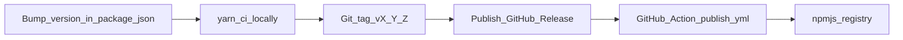

# Publishing to npmjs.com

This document describes how maintainers ship [`@clew-ai/dossier`](https://www.npmjs.com/package/@clew-ai/dossier) to the public npm registry, how CI fits in, and what is included in the published package.

## Prerequisites

- **npm org**: Permission to publish packages under the `@clew-ai` scope on [npmjs.com](https://www.npmjs.com/).
- **Local one-off publishes**: `npm login` (or `npm adduser`) with an account that has publish rights. Use an interactive session when not using CI.
- **CI publishes**: An npm **Automation** token (recommended when 2FA is enabled on the publishing account). Create it under npm account settings and store it only in GitHub repository secrets.

## What gets published

[`package.json`](../package.json) limits the tarball with the `files` field:

- `dist/` — compiled CLI and library entry (`tsup` output)
- `library/` — bundled rules and skills

Source (`src/`), tests, and docs are **not** in the package. Confirm before a release:

```bash
yarn pack --dry-run
```

Or create a tarball and inspect it:

```bash
yarn pack
tar -tzf clew-ai-dossier-v*.tgz | head
```

Scoped packages default to **restricted** visibility; this repo sets `publishConfig.access` to **`public`** so installs work without auth.

## One-time GitHub setup

1. Open the repository on GitHub: **Settings → Secrets and variables → Actions**.
2. Create a repository secret named **`NPM_TOKEN`** with the npm automation (or classic) token value.
3. The [Publish workflow](../.github/workflows/publish.yml) runs `npm publish` with `NODE_AUTH_TOKEN` set from that secret.

Without `NPM_TOKEN`, publishing from GitHub Releases will fail at the publish step.

## Recommended release flow

The [publish workflow](../.github/workflows/publish.yml) triggers when a **GitHub Release** is **published** (not saved as a draft).

1. **Bump the version** in `package.json` on `main` (direct commit or pull request). Follow [semver](https://semver.org/) (`MAJOR.MINOR.PATCH`).
2. **Run CI locally** so failures surface before CI:

   ```bash
   yarn ci
   ```

3. **Commit and push** the version bump to `main`.
4. **Tag** the release commit (example for `0.2.0`):

   ```bash
   git tag v0.2.0
   git push origin v0.2.0
   ```

5. On GitHub, **create a Release** from that tag, add release notes, and **Publish release**. The workflow installs dependencies, runs `yarn ci`, then `npm publish`.

Ensure the tag’s tree matches the `version` field in `package.json`. npm rejects publish if the registry already has that version.



## CI on every push

[`.github/workflows/ci.yml`](../.github/workflows/ci.yml) runs on pushes and pull requests targeting `main`. It runs `yarn install --frozen-lockfile` and **`yarn ci`** (typecheck, tests, build). Fix failures before merging or tagging.

## Manual publish (fallback)

From a clean checkout on the release commit:

```bash
yarn install --frozen-lockfile
yarn ci
npm publish
```

Use a logged-in npm account or set `NODE_AUTH_TOKEN` in the environment to your token. Prefer the GitHub Release flow so publishes stay auditable and consistent.

## npm lifecycle scripts

Publishing runs npm lifecycle hooks in order:

- **`prepublishOnly`**: `yarn typecheck && yarn test`
- **`prepack`**: `yarn build` (also runs when packing the tarball)

So the published artifact always includes a fresh `dist/` build after tests pass.

## Post-publish checks

- Open the [package page on npm](https://www.npmjs.com/package/@clew-ai/dossier) and confirm the new version.
- Smoke-test install: `yarn global add @clew-ai/dossier@<version>` (or `npm install -g`) and run `dossier --version`.

## Alternative: publish on tag push only

The documented flow uses **GitHub Releases** so notes and artifacts stay attached to the release. If you prefer publishing immediately when a `v*` tag is pushed (without creating a Release), add a separate workflow with `on.push.tags: ['v*']` and the same install / `yarn ci` / `npm publish` steps. Only one workflow should publish per version to avoid double publishes.
